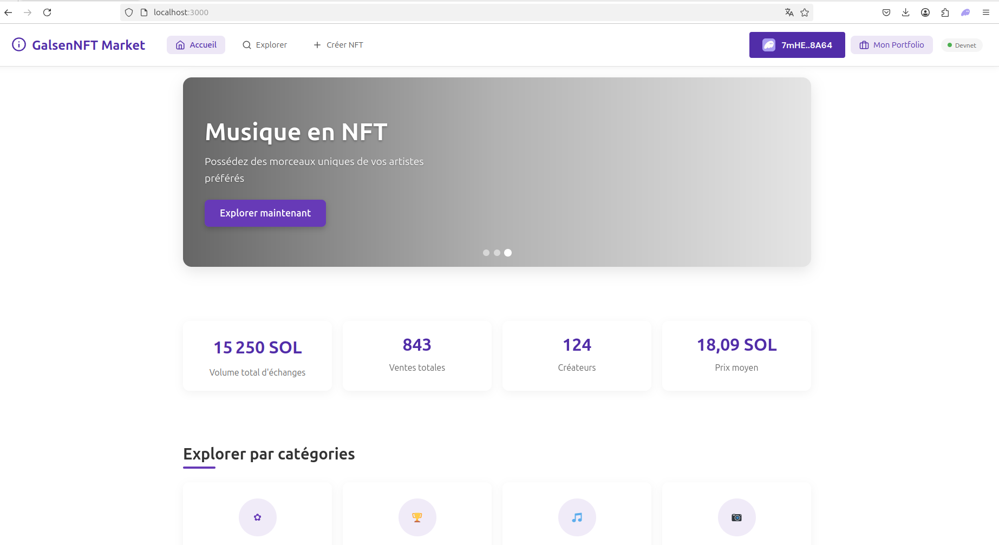

# NFT Marketplace Solana

Une marketplace NFT décentralisée construite sur la blockchain Solana pour créer, acheter et vendre des NFTs.



## Fonctionnalités

- ✅ Explorer et découvrir des NFTs
- ✅ Créer et minter de nouveaux NFTs
- ✅ Mettre des NFTs en vente
- ✅ Acheter des NFTs avec SOL
- ✅ Portfolio utilisateur pour gérer vos NFTs
- ✅ Intégration avec les wallets Phantom et Solflare

## Prérequis

Avant de commencer, assurez-vous d'avoir installé :

- [Node.js](https://nodejs.org/) (v16.x ou supérieur)
- [npm](https://www.npmjs.com/) (v8.x ou supérieur)
- [Rust et Cargo](https://www.rust-lang.org/tools/install)
- [Outils CLI Solana](https://docs.solana.com/cli/install-solana-cli-tools)
- Un wallet Solana (extension navigateur Phantom ou Solflare)

## Installation et Déploiement du Projet

### 1. Installation des Dépendances

```bash
# Cloner le dépôt
git clone https://learn.zone01dakar.sn/git/alassall/nft-marketplace
cd nft-marketplace

# Installer les dépendances Rust et compiler le programme Solana
cargo build-bpf

# Installer les dépendances frontend
cd app
npm install
```

### 2. Compilation et Déploiement du Smart Contract

```bash
# Configurer Solana CLI pour utiliser Devnet
solana config set --url devnet

# Générer une nouvelle paire de clés si vous n'en avez pas
solana-keygen new --outfile ~/.config/solana/id.json

# Obtenir des SOL de test
solana airdrop 2

# Compiler le programme (si non déjà fait)
cargo build-bpf
cargo build

# Déployer le programme
solana program deploy ./target/deploy/solana_nft_marketplace.so
solana deploy
# Notez l'ID du programme qui s'affiche après le déploiement
```
L'ID du programme ressemblera à `4hVp7QQKuowuf1SgPVXcD5YkTrHHiDRPbn4V9HKvYwrT`. Assurez-vous de noter cette adresse.

### 3. Configuration et Lancement de l'Interface

```bash
# Naviguer vers le répertoire app
cd app

# Configurer l'ID du programme (remplacez avec votre ID obtenu lors du déploiement)
echo "REACT_APP_PROGRAM_ID=votre_id_programme" > .env

# Démarrer le serveur de développement sur le port 3000
PORT=3000 npm start
```
L'application sera accessible à l'adresse [http://localhost:3000](http://localhost:3000).

### 4. Initialisation de la Marketplace

- Connectez votre wallet
- Allez sur la page d'accueil
- Cliquez sur **"Initialiser la Marketplace"** dans la section admin (visible uniquement lorsque connecté)

## Déploiement de NFTs d'Exemple

Pour déployer des NFTs de test sur la marketplace, suivez ces étapes :

1. Connectez votre wallet Phantom ou Solflare à l'application
2. Cliquez sur **"Créer NFT"** dans la barre de navigation
3. Remplissez le formulaire avec les détails de votre NFT :
    - Téléchargez une image (JPG, PNG, GIF, max 10MB)
    - Donnez un nom à votre NFT
    - Ajoutez une description
    - Définissez des attributs si souhaité (optionnel)
4. Cliquez sur **"Créer le NFT"**
5. Approuvez la transaction dans votre wallet
6. Une fois la transaction confirmée, votre NFT sera créé sur Solana Devnet
7. Pour le mettre en vente, accédez à votre **Portfolio**, sélectionnez le NFT et définissez un prix

## NFTs Disponibles

### Nombre Total de NFTs
Le nombre total de NFTs disponibles sur la marketplace est affiché en haut de la page **Explorer**.

### NFTs d'Exemple Préchargés
Pour les besoins de test, les NFTs d'exemple suivants sont disponibles sur la marketplace :

- **Galaxy Warrior #001** - Un guerrier cybernétique perdu dans les confins de la galaxie, prêt à défendre son empire interstellaire. Ce NFT fait partie d’une collection exclusive de 500 guerriers uniques. (**0.5 SOL**)
- **Paysage #7** - Un paysage de montagne au coucher du soleil (**0.8 SOL**)
- **Héros PixelArt** - Un héros en pixel art prêt pour l'aventure (**0.3 SOL**)

## Utilisation de la Marketplace

### Page d'Accueil

La page d'accueil présente :

- Le titre **"Galsen Market NFT"** et son thème
- Des NFTs en vedette (jusqu'à 5)
- Un bouton pour **connecter votre wallet**
- Une navigation vers la page **Explorer**

### Page Explorer

Parcourez tous les NFTs disponibles :

- Visualisez plusieurs NFTs
- Filtrez les NFTs par catégorie (fonctionnalité optionnelle)
- Accédez à la page **"Soumettre un NFT"**

### Connexion d'un Wallet

Pour interagir avec la marketplace :

1. Cliquez sur **"Select Wallet"** en haut à droite
2. Choisissez **Phantom** ou **Solflare**
3. Approuvez la connexion dans votre extension de wallet
4. Une fois connecté, un bouton **"Mon Portfolio"** apparaîtra

### Achat de NFTs

Pour acheter un NFT :

1. Connectez votre wallet
2. Trouvez un NFT dans la page **Explorer** ou la section **en vedette**
3. Cliquez sur le NFT pour voir les détails
4. S'il est en vente, cliquez sur **"Acheter pour X SOL"**
5. Approuvez la transaction dans votre wallet
6. Le NFT sera transféré à votre wallet et apparaîtra dans votre **Portfolio**

### Vente de NFTs

Pour mettre votre NFT en vente :

1. Accédez à votre **Portfolio** (visible uniquement lorsque connecté)
2. Cliquez sur le NFT que vous voulez vendre
3. Entrez un prix en **SOL**
4. Cliquez sur **"Mettre en vente"**
5. Approuvez la transaction dans votre wallet
6. Votre NFT sera maintenant visible dans la **marketplace**

### Annuler une mise en vente

1. Trouvez votre NFT listé dans votre **Portfolio**
2. Cliquez dessus pour voir les détails
3. Cliquez sur **"Annuler la vente"**
4. Approuvez la transaction dans votre wallet

---

🚀 **Félicitations !** Vous avez maintenant une marketplace NFT fonctionnelle sur Solana !
